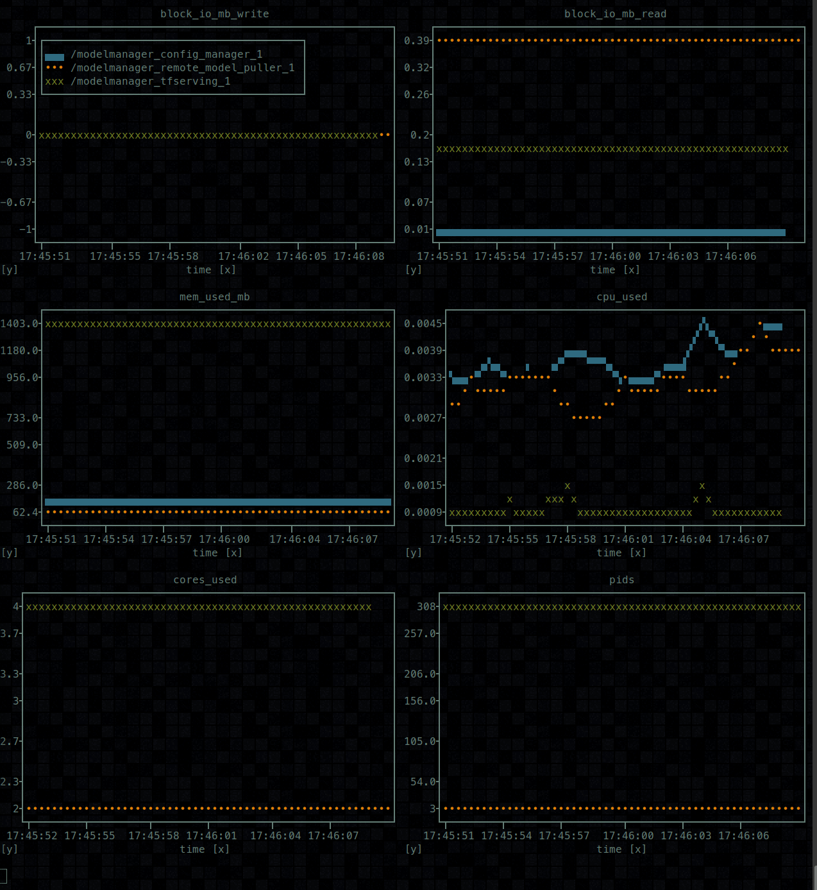

# docker-load-graph
---

Have you ever been working with a docker stack, and been interested in how your containers fair over time? Me too.

This project exists to solve that problem.

## What does it do?

Very simply this project uses [plotext](https://github.com/piccolomo/plotext) to display the current status
of key docker metrics in real time on the command line.

